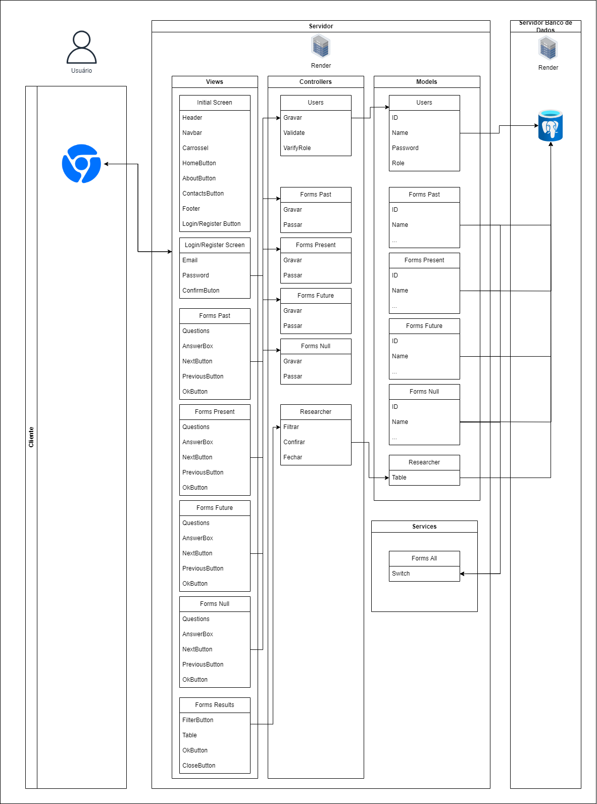

# Diagrama de arquitetura

## Abandono zero - Patrulha Canina

#### <a href="https://www.linkedin.com/in/davi-abreu-da-silveira/">Davi Abreu da Silveira</a>

## Professores:
<a href="https://youtu.be/hvL1339luv0?si=J6ICk7HZE_xzRyuH">Afonsinho Lindo do Meu Coração (clica aqui :) )</a>

## Sumário

[1. Introdução](#c1)

[2. Arquitetura](#c2)

[3. Link para download](#c3)

[4. Views](#c4)

[5. Controlers](#c5)

[6. Models](#c6)

[7. Services](#c7)

[8. Infraestrutura](#c8)

## Descrição:

&nbsp;&nbsp;&nbsp;&nbsp;A problemática central está na falta de dados e base científica relacionados às motivações para adoção/compra e abandono de animais. Nosso instituto parceiro se dedica a compreender essa questão para enfrentar o desafio maior do abandono, buscando reduzir esse índice. O projeto visa preencher essa lacuna no conhecimento científico e social sobre essas relações entre os seres humanos e animais de estimação, fornecendo uma base de dados confiável e abrangente. Para isso, estamos desenvolvendo uma aplicação web intuitiva e amigável, tanto em termos de usabilidade (front-end) quanto na coleta de informações, para os tutores (pesquisados) e também os pesquisadores do INSPA que farão uso dessas informações, proporcionando uma base de dados bem estruturada e de alta qualidade, gerando análises e visualizações dos motivos e comportamentos dos tutores respondentes.

## Arquitetura: 
MVC (Model-View-Controller) 

## Ferramenta de Diagramação: 
Ferramenta de diagração utilizada: draw.io

 Diagrama de arquitetura   	

Fonte: Material produzido pelos autores, 2024

## Link de download draw.io

https://drive.google.com/file/d/1lvrkyBdNkOMikwwuDwzrzmsAu9iIFZi7/view?usp=sharing

## Views (Views):

&nbsp;&nbsp;&nbsp;&nbsp;&nbsp;&nbsp;As views representam a camada de apresentação da aplicação. Elas são responsáveis por exibir os dados ao usuário de uma maneira que seja compreensível e interativa. 

&nbsp;&nbsp;&nbsp;&nbsp;&nbsp;&nbsp; Esse projeto possui 7 views, sendo elas: Initial Screen, Login/Register Screen, Forms Past, Forms Present, Forms Future, Forms Null, Forms Results.

&nbsp;&nbsp;&nbsp;&nbsp;&nbsp;&nbsp;Falando da primeira, a Initial Screen, ela tem tudo que a tela inicial da aplicação, desde a navbar, header, carroseis com imagens do projeto e um rodapé. Fora isso, o usuário pode interagir nela com os botões, como o de login/register, e os outros que levam o usuário para outras seções dessa mesma tela inicial (que poderiam ser acessadas com a rolagem da scrollbar, como a de contatos e o sobre). Exatamente por não interagir com outros elementos ela não possui setas que conectem essa view à algum controller.

&nbsp;&nbsp;&nbsp;&nbsp;&nbsp;&nbsp;Depois temos a view de login, que pode ser acessada clicando no botão de login/register na Initial Screen. Nessa parte, o usuário poderá colocar seu email e senha para fazer o login/registro, essas informações serão gravadas, validadas e verificadas por um controller chamado “User”, direcionará essas informações para serem gravas no banco de dados.

&nbsp;&nbsp;&nbsp;&nbsp;&nbsp;&nbsp;Em seguida temos 4 views para armazenar informações dos diferentes estilos de formulários que teremos no site, dentre eles, um para pessoas que já tiveram cães (Past), um para quem tem um cão (Present), outro para quem quer ter um cão (Future) e um formulário chamado Null, que seria para quem não tem, nunca teve e nem quer ter. Esses formulários contaram com as questões, uma caixa de respostas, que pode ser tanto de clicar quanto para escrever, botões que deixem o usuário percorrer as questões e um botão (OkButton) para que ele confirme suas respostas.   

&nbsp;&nbsp;&nbsp;&nbsp;&nbsp;&nbsp;Por fim, temos um view chamado Forms Results, que é para os cientistas e pesquisadores, que, autorizados pelo administrador, tenham acesso aos resultados da pesquisa, podendo ver as tabelas com os dados preenchidos dos respondentes. Esse view contará com as tabelas (table), um botão para poder filtrar os resultados (por tempo ou região, por exemplo), um botão de Ok para o filtro ser aplicado e um botão de fechar, também para a aba de filtro, e um botão para que o pesquisador possa fazer o download daquelas informações que ele está vendo.

## Controladores (Controllers):

&nbsp;&nbsp;&nbsp;&nbsp;Na arquitetura MVC os controllers são responsáveis por receber requisições do usuário, interpretá-las e coordenar as interações entre os modelos (models) e as views. Eles garantem que a lógica de negócios seja aplicada corretamente aos dados e que a interface do usuário seja atualizada de acordo com as ações do usuário e as mudanças nos dados.

&nbsp;&nbsp;&nbsp;&nbsp;No modelo apresentado acima existem 6 controllers, o primeiro, chamado Users, serve para guardar e validas as informações do usuário com o servidor, sendo o caminho intermediário entre a tela de login e o banco de dados com as informações dos usuários. Ele possui os methods “Gravar” para gravar os dados no banco de dados, “Validate”, para validar os dados no caso de um usuário tentando fazer login, e também, o method “VerifyRole”, para poder dar acesso ao usuário ou ao formulário, ou aos resultados destes, a depender do seu role no sistema. 

&nbsp;&nbsp;&nbsp;&nbsp;Temos também 4 controllers para os formulários, todos eles contendo os mesmos methods, sendo eles: Forms Past, Forms Present, Forms Future, Forms Null. Dessa forma, eles servem para fazer a conexão entre o que o usuário vê em cada formulário no front-end e as informações que estão sendo guardadas de acordo com suas respostas na base de dados. Para que isso possa acontecer, ele utiliza dos methods Gravar e Passar, sendo o primeiro para que a aplicação possa colocar essas informações no banco de dados e a segunda para a passagem de uma pergunta para outra pelo usuário no front-end do site.

&nbsp;&nbsp;&nbsp;&nbsp;Por fim, temos um controller para fazer a ponte na parte do pesquisador, ele possui os methods de filtragem, para poder gerenciar as informações que o pesquisador quer visualizar e o method DownloadInfo, que serve para poder serem baixadas do servidor as informações que o cientista está/quer ver.

## Modelos (Models):

&nbsp;&nbsp;&nbsp;&nbsp;Os models representam a camada de acesso aos dados e a lógica de negócios subjacente à aplicação. Em uma aplicação típica baseada em MVC (Model-View-Controller), os modelos são responsáveis por gerenciar os dados da aplicação e as regras de negócios associadas a esses dados.

&nbsp;&nbsp;&nbsp;&nbsp;Os modelos geralmente encapsulam as operações CRUD (Create, Read, Update, Delete) para interagir com o banco de dados ou outras fontes de armazenamento de dados. Eles são responsáveis por consultar, atualizar e manipular os dados conforme necessário para atender aos requisitos da aplicação. Além disso, os modelos podem conter validações de dados, lógica de negócios complexa e outras funcionalidades relacionadas ao processamento e manipulação dos dados.

&nbsp;&nbsp;&nbsp;&nbsp;Na arquitetura produzida acima, foram feitos 6 models, um para cada controller, basicamente. O primeiro deles, é chamado Users e está relacionado ao controller Users, ele têm os atributos ID, Name, Password e Role, que fazem parte do cadastro/login do usuário na aplicação, acessando assim o banco de dados quando um desses dois “eventos” acontecem e permitindo que a aplicação funcione.

&nbsp;&nbsp;&nbsp;&nbsp;Após isso, temos os models para acesso aos dados dos formulários, eles mostram informações (atributos) como ID, Nome, idade, entre outros que não estão sendo mostrados na arquitetura por serem muitos itens. Eles se conectam tanto à base de dados mas também se conectam aos services, e por isso não tem nenhuma seta do lado esquerdo, mas isso será explicado no tópico 8. 

&nbsp;&nbsp;&nbsp;&nbsp;Ao final da lista, temos o controller Researcher, que, como o nome diz, serve para o pesquisador poder ter acesso, em sua página de administrador do sistema, às tabelas que contêm os dados da pesquisa

## Services:

&nbsp;&nbsp;&nbsp;&nbsp;Os services são responsáveis por encapsular a lógica de negócios e fornecer funcionalidades específicas para outras partes da aplicação, como controladores, modelos e outras classes ou componentes.

&nbsp;&nbsp;&nbsp;&nbsp;A camada de serviços é comumente usada para separar a lógica de negócios da lógica de apresentação ou acesso a dados. Isso promove uma melhor modularidade e reutilização de código, além de facilitar os testes automatizados, já que a lógica de negócios pode ser isolada em serviços que podem ser testados independentemente de outras partes do sistema.

&nbsp;&nbsp;&nbsp;&nbsp;Neste caso, ela está sendo usada para que o usuário veja os resultados por meio dela, então ela se conecta as camadas models de formulário que têm acesso à base de dados (Forms Past, Forms Present, Forms Future, Forms Null) e também ao controller “Research” para poder mostrar essas informações na tela da página. Dessa forma, ele atua quase que como um “mediador”.

## Infraestrutura:

&nbsp;&nbsp;&nbsp;&nbsp;O projeto utiliza um banco de dados (Postgree) para armazenar informações essenciais, como dados dos usuários, respostas dos formulários e outras informações relacionadas à pesquisa. Os controllers interagem com os modelos para acessar e manipular os dados conforme necessário, garantindo que a lógica de negócios seja aplicada corretamente aos dados armazenados no banco de dados.

A aplicação pode, tamém, depender de APIs externas para funcionalidades específicas, como integração com serviços de autenticação, que será necessária para evitar respostas de bots, que atrapalham a pesquisa. A integração com APIs externas geralmente ocorre nos controladores, onde as requisições HTTP são enviadas para as APIs externas e as respostas são processadas conforme necessário.